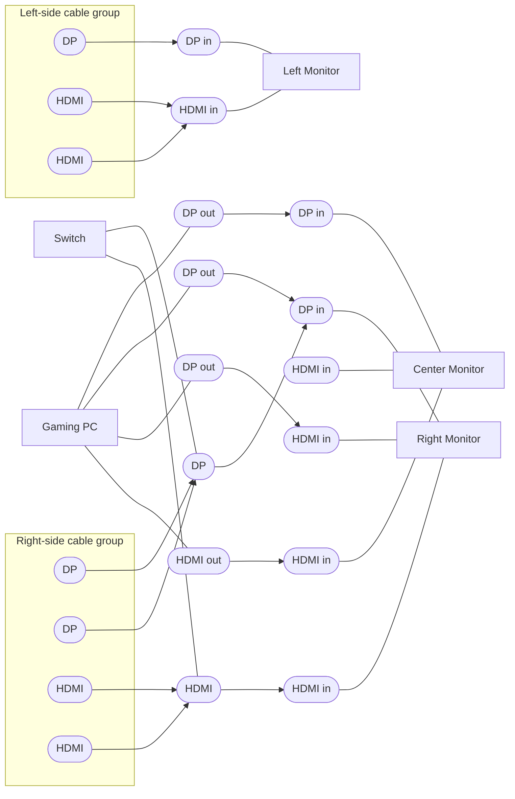

# Desktop Setup Diagram

This is a clean, editable Mermaid version of the hand-drawn diagram.

> Note: A few line endpoints in the photo are ambiguous, so those are marked as `unlabeled` placeholders for easy updates.

## How To Update

- Open this file and edit labels/links in the Mermaid block.
- Preview in GitHub or any Mermaid-enabled Markdown viewer.
- If you want, I can do a second pass and make it exact by walking each cable one by one with you.
