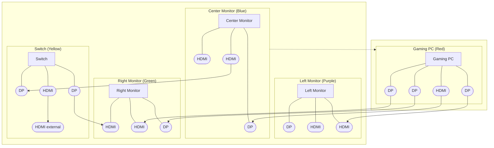

# Desktop Setup Diagram

This is an updated Mermaid version based on your color-coded reference image.

Color mapping used from your markup:
- `Red` = Gaming PC
- `Yellow` = Switch
- `Green` = Right monitor
- `Blue` = Center monitor
- `Purple` = Left monitor

> Note: Port groups are now modeled exactly by device color box. Cable paths are drawn for the visible runs; if you want, I can do one more pass to label each cable with a nickname (e.g., `Cable A`, `Cable B`) for easier future edits.

## How To Update

- Open this file and edit labels/links in the Mermaid block.
- Preview in GitHub or any Mermaid-enabled Markdown viewer.
- If you want full precision, send cable mapping in this format and I will update in one pass:
  - `source port -> destination port`
  - Example: `PC_DP2 -> RightMonitor_DP`
